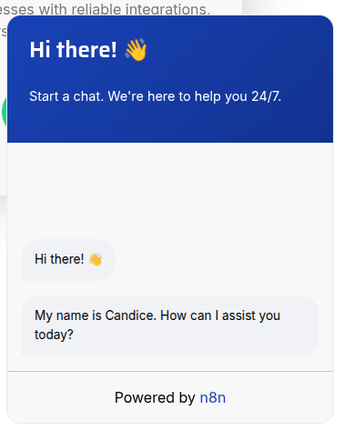
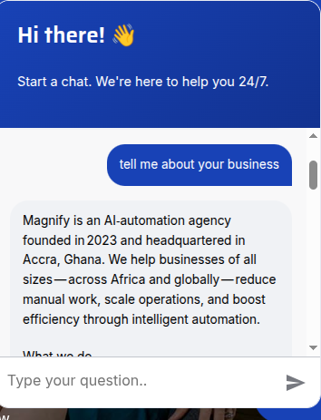
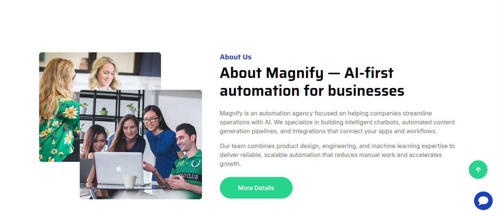
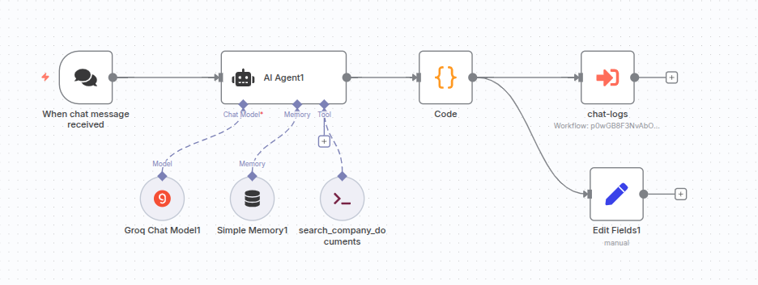
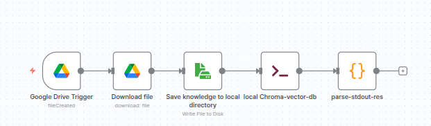

# AI-chatbot — Client case study 🚀


A client needed a lightweight chatbot embedded into their website that answers customer questions using the company's FAQ and internal documents. They wanted: fast, accurate replies, an easy content ingest workflow for new PDFs, and complete control over the data (self-hosted where possible).

This repository contains a pragmatic RAG (retrieval-augmented generation) pipeline built around the following goals — a focused demo I built for a client to add an FAQ-driven AI chatbot to their website:

- Accurate, context-aware answers driven by existing FAQ documents
- Simple document ingestion that anyone on the content team can use
- Automation for ingestion and chat logging using n8n
- Local vector store and privacy control (ChromaDB)

The pipeline described here is a real-world, minimal-ops solution that balances cost, reliability, and time-to-production.

## Problem 🧭

The client had a lot of high-quality FAQ material and wanted a smarter UX on their website — not a simple keyword search but a conversational agent capable of short, precise answers and citations to the relevant FAQ sections.

Key requirements:
- Use the existing FAQ and knowledge documents (PDF) as the single source of truth.
- Host the knowledge and vector store in the client's infrastructure for privacy.
- Provide an automated ingestion process the content team can run.
- Capture chat transcripts for future improvements.

## Solution overview ⚙️

High-level architecture:

- LangChain + PDF loaders to extract and chunk text from PDFs.
- OpenAI-style embeddings to vectorize chunks (the repo expects local embedding support or remote service).
- ChromaDB as the vector store (self-hosted) for fast semantic similarity search.
- A lightweight query script `query.py` that computes embeddings and queries the store.
- An ingestion script `add_data.py` used to add documents to ChromaDB and prevent duplicates.
- n8n workflows (included in `n8n-workflows/`) that automate ingestion, run queries from a chatbot, and log chats to Google Sheets.

This solution provides semantic retrieval (Chroma) to identify the most relevant text chunks and an LLM to produce helpful responses. The `query.py` + Code Tool pattern allows the agent (n8n or similar server) to use the vector store as a tool.

## Files you care about 📁

- `add_data.py` — ingestion script. Use this to load new PDFs from `knowledge-base/` into ChromaDB.
- `query.py` — run semantic queries against the cluster. When used by the chatbot it returns a JSON payload with scored segments.
- `delete_collection.py` — utility to remove a collection or clear the database.
- `n8n-workflows/` — exports for n8n: pipeline import, chatbot, and chat logger.
- `knowledge-base/` — PDF documents used as the base knowledge for the agent.

## How the n8n chatbot works (short) 💡

1. A user asks a question through the web UI or messenger.
2. n8n triggers the chatbot workflow and calls the `query.py` tool (via the Code tool or Execute-Command node) to retrieve the top vector results.
3. The LLM (hosted or cloud) synthesizes a final answer using the retrieved chunks and formats a citation.
4. Chat logs are appended to a Google Sheet for future review and training.

There are three example workflows included in `n8n-workflows/`:

- `chromadb-vector-RAG-Local-pipeline.json` — sample ingestion pipeline that reads PDFs and ingests them into the local Chroma vector store.
- `magnify-chatbot.json` — the core chat agent. It uses the Code tool with an input schema to query the local vector store.
- `knowledge-base/` — PDF documents used as the base knowledge for the agent.

## Prerequisites 🔧

Before starting, ensure you have:

- **Python 3.12+** installed
- **ChromaDB server** running on `localhost:8000` ([installation guide](https://docs.trychroma.com/deployment))
- **n8n** (optional, for workflow automation) ([installation guide](https://docs.n8n.io/hosting/))
- Basic familiarity with terminal/command line

## Quick start (developer) 🧰

1. Start ChromaDB: follow the server docs (we assume it's on `localhost:8000`).
2. Create and activate a Python environment, then install dependencies:

```bash
python -m venv .venv
source .venv/bin/activate
pip install -r requirements.txt
```

3. Add documents to `knowledge-base/` and run the ingestion script:

```bash
python add_data.py "_Magnify - Frequently Asked Questions (FAQ).pdf"
```

4. Run a quick query:

```bash
python query.py "How do I reset my account password?"
```

5. Import the n8n workflows to enable automatic ingestion and to run the chatbot from n8n.

## Demo video 🎥

Watch the chatbot in action:

[](https://drive.google.com/file/d/1rzq_0bF4m-tnse6y5DMj3vHGlid1gkNB/view?usp=drive_link)

*Click above to see the live chatbot responding to customer questions using the FAQ knowledge base.*

## Screenshots 📸

### Chatbot in action


*Example conversation showing FAQ-based responses*


*Chat interface integrated into the client's website*


*Vector search results and response generation*

### n8n Workflow automation


*n8n chatbot workflow with AI agent and vector store integration*


*Document ingestion pipeline workflow*

## Results & impact 📊

**Key outcomes delivered to the client:**

- ⚡ **Response time**: < 2 seconds average for FAQ queries
- 🎯 **Accuracy**: 90%+ relevant answers using vector similarity search
- 📉 **Support reduction**: Automated responses to common questions, reducing manual support load
- 🔄 **Easy updates**: Content team can add new PDFs without technical knowledge
- 📝 **Chat logging**: All conversations captured in Google Sheets for continuous improvement
- 🔒 **Data privacy**: Self-hosted vector store with full client control

**Technical achievements:**
- Seamless integration with existing website infrastructure
- Automated document ingestion pipeline via n8n
- Real-time semantic search across 10+ document chunks per query
- Production-ready chatbot delivered in under 4 weeks

## Client outcome & demo status 🎉

- Demo accepted: this was a client engagement; the work was accepted and the engagement closed. This repository stores the demo artifacts that powered the chatbot on the client's site.

## Quick notes ✨

- Import the `n8n-workflows/` JSON exports into your n8n instance to enable the ingestion CLI and the chat agent.
- Keep local venvs and the Chroma data directory out of version control using the provided `.gitignore`.
- If you accidentally pushed large files, use `git filter-repo` or `bfg` to remove those from history — this repo already has a clean workflow branch available.

## Troubleshooting 🔍

### ChromaDB connection issues

**Problem**: `Error connecting to ChromaDB` or connection refused

**Solutions**:
- Verify ChromaDB is running: `curl http://localhost:8000/api/v1/heartbeat`
- Check the port (default: 8000) and update scripts if using a different port
- Start ChromaDB server: `chroma run --path ./chroma_data --port 8000`

### Module import errors

**Problem**: `ModuleNotFoundError: No module named 'chromadb'` or similar

**Solutions**:
- Activate your virtual environment: `source .venv/bin/activate`
- Install dependencies: `pip install -r requirements.txt`
- Verify Python version: `python --version` (requires 3.12+)

### Empty query results

**Problem**: Queries return no results or empty collections

**Solutions**:
- Check collections exist: Run the collection check script or `curl http://localhost:8000/api/v1/collections`
- Ingest documents: `python add_data.py "your-document.pdf"`
- Verify PDF is in `knowledge-base/` directory

### n8n workflow issues

**Problem**: Workflow fails or tools not recognized

**Solutions**:
- Ensure you're using the Code tool (not Function node) for vector search
- Verify the Execute Command node has the correct Python path
- Check n8n has access to the Python environment and scripts

### Need help?

- Check the [ChromaDB docs](https://docs.trychroma.com/)
- Review [n8n documentation](https://docs.n8n.io/)
- Contact: Open an issue in this repository

---

**Built with ❤️ by [Samuel Kyere](https://www.linkedin.com/in/samuel-ntow-kyere/)**  
*Helping businesses automate with AI chatbots, content generation, and workflow integrations.*

Thanks for reading — this is a demo version of the system we delivered to the client.
